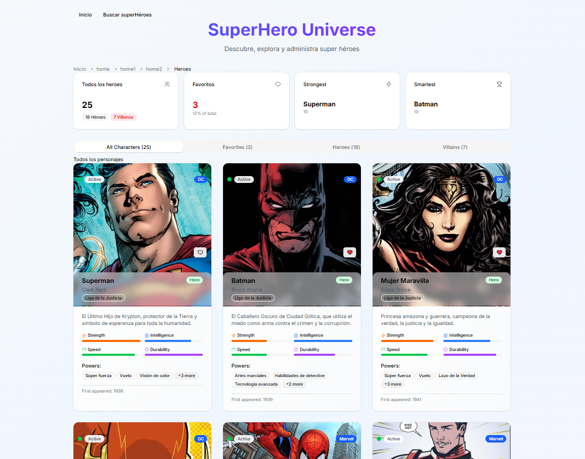
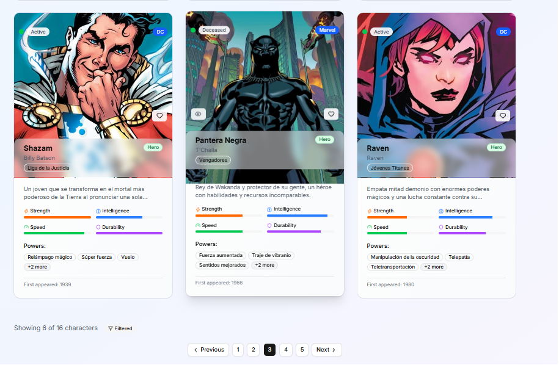
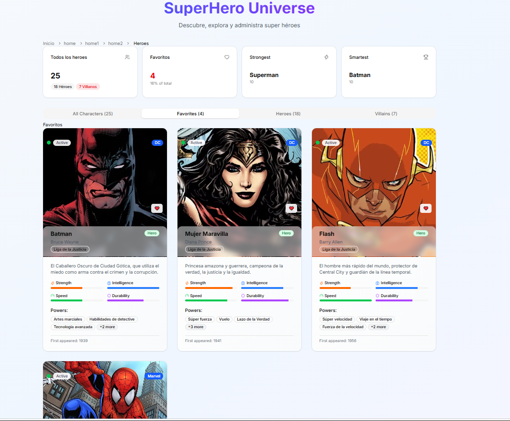
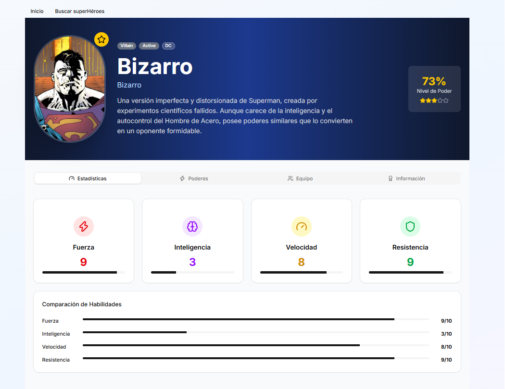
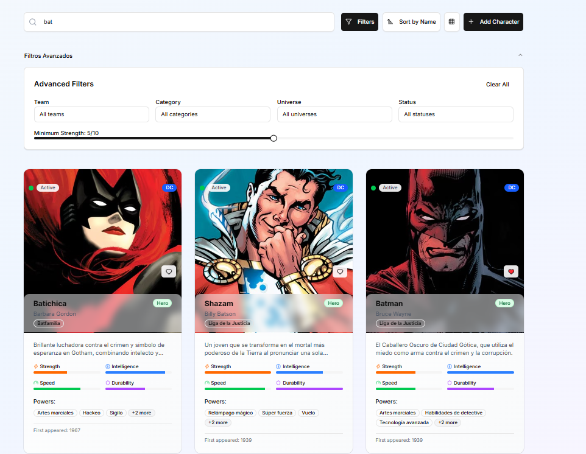

# Hero App

Aplicación web desarrollada con **React y TypeScript** para explorar, buscar y organizar información de superhéroes y villanos.

Este proyecto implementa una interfaz moderna y responsive, navegación mediante rutas, consultas a una API REST, búsqueda, filtros avanzados, favoritos y diferentes vistas para organizar los personajes.

La aplicación consume una **API REST existente**, conectada a una base de datos PostgreSQL, permitiendo trabajar con información real desde el frontend.

## Demo

**Aplicación desplegada:**
https://resplendent-biscochitos-3286c2.netlify.app/

> La aplicación está desplegada y funcional. Algunas imágenes pueden tardar unos segundos en cargar debido al entorno de despliegue, pero se cargan correctamente.

## Capturas

### Página principal




La página principal presenta un dashboard con información general del universo de personajes:

- Total de personajes.
- Personajes favoritos.
- Héroe más fuerte.
- Personaje más inteligente.
- Cantidad de héroes y villanos.
- Listado de personajes.

### Favoritos



Trae la información de los héroes los cuales el usuario defina como favoritos

### Héroe



Muestra toda la información acerca del héroe elegido

### Búsqueda y filtros avanzados



La aplicación incluye una sección de búsqueda que permite localizar personajes y aplicar diferentes filtros.

Entre ellos:

- Búsqueda por nombre.
- Fuerza mínima.
- Ordenamiento por nombre.

# Funcionalidades

## Exploración de personajes

La aplicación permite visualizar diferentes personajes y consultar información como:

- Nombre.
- Descripción.
- Identidad.
- Universo.
- Equipo.
- Categoría.
- Estado.
- Poderes.
- Estadísticas.
- Imagen del personaje.

Las estadísticas incluyen:

- Strength
- Intelligence
- Speed
- Durability

## Sistema de favoritos

Los personajes pueden marcarse como favoritos mediante la interfaz.

La aplicación también cuenta con una vista específica para consultar los personajes seleccionados como favoritos.

## Héroes y villanos

Los personajes pueden organizarse según su categoría:

- Todos los personajes.
- Héroes.
- Villanos.
- Favoritos.

Esto permite explorar el contenido de una manera más organizada.

## 🔎 Búsqueda

La aplicación permite buscar personajes mediante su nombre.

Los resultados se actualizan utilizando las consultas realizadas a la API.

## Estadísticas generales

El dashboard muestra información calculada a partir de los datos obtenidos:

- Total de personajes.
- Total de héroes.
- Total de villanos.
- Total de favoritos.
- Personaje más fuerte.
- Personaje más inteligente.

## Navegación

La aplicación utiliza **React Router** para gestionar la navegación entre las diferentes páginas.

Además, algunas páginas utilizan carga diferida mediante `lazy()`:

```tsx
const SearchPage = lazy(() => import("@/heroes/pages/search/SearchPage"));
```

Esto permite cargar determinadas partes de la aplicación bajo demanda.

# Tecnologías utilizadas

## Frontend

| Tecnología         | Uso                                                 |
| ------------------ | --------------------------------------------------- |
| **React**          | Construcción de la interfaz                         |
| **TypeScript**     | Tipado estático y desarrollo más seguro             |
| **Vite**           | Entorno de desarrollo y build                       |
| **React Router**   | Navegación y manejo de rutas                        |
| **TanStack Query** | Consultas y gestión de datos provenientes de la API |
| **Tailwind CSS**   | Estilos y diseño responsive                         |
| **shadcn/ui**      | Componentes reutilizables de interfaz               |
| **ESLint**         | Análisis y calidad del código                       |
| **Prettier**       | Formateo del código                                 |

## Integración

| Tecnología     | Uso                                    |
| -------------- | -------------------------------------- |
| **REST API**   | Fuente de datos para el frontend       |
| **NestJS**     | Backend utilizado por la API           |
| **PostgreSQL** | Base de datos utilizada por el backend |
| **Postman**    | Pruebas y validación de endpoints      |

## Herramientas

- Git
- GitHub
- VS Code
- Node.js
- npm
- Netlify
- Postman

# Consumo de la API

El frontend no contiene toda la información de los personajes de forma estática.

Los datos se obtienen mediante peticiones a una API REST.

El proceso general es:

```text
1. El usuario interactúa con la aplicación.
                ↓
2. React actualiza los parámetros necesarios.
                ↓
3. TanStack Query realiza la consulta.
                ↓
4. La API procesa la solicitud.
                ↓
5. El backend consulta PostgreSQL.
                ↓
6. La API devuelve los datos.
                ↓
7. TanStack Query procesa la respuesta.
                ↓
8. React actualiza la interfaz.
```

Esta integración permitió trabajar con datos provenientes de un servicio externo en lugar de depender únicamente de información local.

# Instalación

## Requisitos

Para ejecutar el frontend localmente necesitas:

- Node.js
- npm
- Git

El backend y la base de datos son necesarios si deseas ejecutar todo el sistema localmente.

## 1. Clonar el repositorio

## 2. Instalar dependencias

`npm install`

## 3. Configurar variables de entorno

Crear un archivo `.env` tomando como referencia el archivo de variables de entorno de ejemplo del proyecto.

## 4. Ejecutar el proyecto

`npm run dev`

Vite iniciará el servidor de desarrollo y mostrará la dirección local para acceder a la aplicación.

# Objetivo del proyecto

El objetivo principal fue desarrollar una aplicación frontend moderna que pudiera trabajar con información obtenida desde una API real.

```text
Interfaz
   ↓
Interacción del usuario
   ↓
Consulta de datos
   ↓
API REST
   ↓
Respuesta
   ↓
Actualización de la interfaz
```

El proyecto trabaja con arquitectura organizada y tecnologías actuales del ecosistema React.

## 🔗 Enlaces

**Live Demo:**
https://resplendent-biscochitos-3286c2.netlify.app/

**GitHub:**
[URL_DE_TU_REPOSITORIO](https://github.com/ErickAnderson-10/Heroes-app)
